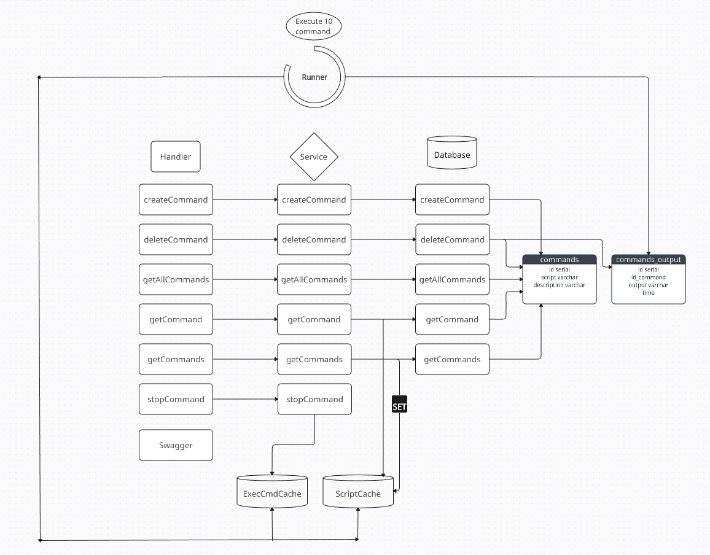

# Тестовое задание для golang dev в Postgres Professional

### 1. Запуск
#### 1.1 Локальный запуск
- Склонировать репозиторий
- ```make postgresinit```: Start postgres in docker container
- ```make server```: Server
- ```make swag_ui```: Swagger

#### 1.2 Docker compose
- Склонировать репозиторий
- ```make build```: start docker containers

### 2. Схема работы



`Handlers`
- createCommand: создает команду в таблице commands
- deleteCommand: удаляет команду и ее вывод из таблиц commands и commands_output
- getAllCommands: получение списка всех команд (не запускает их)
- getCommand: получение и запуск команды
- getCommands: получение и запуск списка команд
- stopCommand: остановка команды

`Runner` занимается запуском команд. Количество запущенных команд ограничено переменной MaxCommandProcess (/server/internal/service/command/runner.go).  
- Если придет одна команда, то `Runner` дождется выполнения этой команды и только после нее займется следующими (если придет в этот момент запрос на выполнение новых команд).  
- Если придет несколько команд, то `Runner` запустит команды параллельно (до MaxCommandProcess включительно).
- Если пришла одна команда, то её вывод будет писаться и в консоль, и в БД.
- Если пришло несколько команд, то их вывод будет писать только в БД.

`ScriptCache` хранит в себе команды, которые хотим выполнить. 

`ExecCmdCache` хранит в себе запущенные команды.

### 3. Дополнительный функционал
- Добавил дополнительные 'ручки':  
    - Получение списка всех команд
    - Удаление команды
    - Остановка команды
- Добавил mock тесты ```make test```.
- Добавил Swagger для наглядного и удобного тестирование API (```make swag_ui```): http://localhost:8000/swagger/index.html
- Добавил migration для удобного добавления и изменения таблиц (используется как пакет).
- Добавил сборку проекта через docker compose (```make build```)

### 4. Примеры команд для тестирования

```json
{
"script": "echo \"The current directory is:\" && pwd && echo \"The user logged in is:\" && whoami",
"description": "query scripts"
}
```

```json
{
  "script": "echo \"Hello there!\" && sleep 10 && echo \"Oops! I fell asleep for a couple seconds!\"",
  "description": "query scripts"
}
```

```json
{
  "script": "ls",
  "description": "query scripts"
}
```